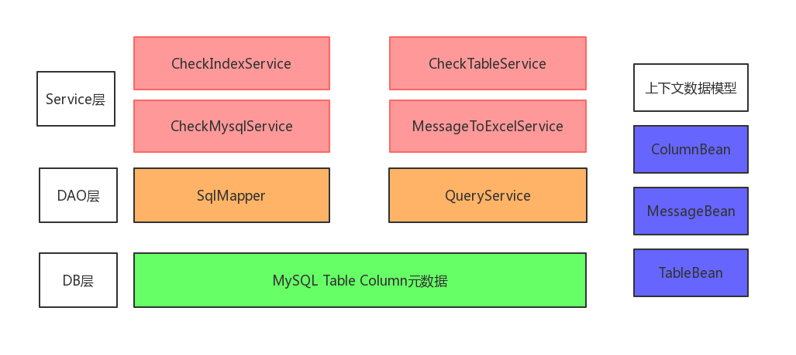

# db-model-check

#### 介绍
基于阿里巴巴代码规约-mysql规范，结合公司数据库设计规范文档与沈老师公众号数据库设计相关文章设计的
数据库表结构设计规范扫描工具

#### 设计背景 

1. 检测数据库元数据是否符合约束符合规范的工具，提高RD的开发效率，重点是避坑，降低维护成本.
2. 在创建mysql DDL语句的时候，提交工单也会报一些SQL警告或者错误，需要自己手动排查，比较浪费时间.
3. RD和QA在开发，测试等多套环境切换迭代开发的时候会出现数据库元数据不一致的地方，等到提测之后才发现数据库表或者字段不一致，影响开发提测效率.
4. RD对数据库设计规范的掌握程度不同，对于所负责模块的MYSQL表设计规范程度也不尽相同，导致项目在开发后期掉进MYSQL表设计不合理，不规范引起的坑中。

#### 设计目标

1. 开发一套适用于互联网高并发场景下的数据库设计检测的工具.
2. 需要支持公司内部DAO框架&JDBC工具类链接场景.
3. 开源版本仅支持mybatis为ORM映射框架.
4. 开源版本不支持双库检查
5. 开源版本不支持DDL变更记录

#### 功能目标

1. 检查数据库表设计
2. 检查数据库字段设计
3. 检查是否存在：视图（View），触发器（Trigger）,存储过程（Proceduer） ，事件（Event）  
4. 智能索引+表间关系检查:（比如a,b两张表，b表中有a_id,需要检查a,b根据a_id出现关联，提醒用户是否需要创建索引等）
5. 对于上面4点的检测结果生成一个result.xlsxExcel文件，按级别区分为：ERROR，WARN，ADVICE

#### 功能设计图
 

#### 检查项

1.  数据库表检测

+ 表名长度检查
+ 表注释检查
+ 表名是否存在大写
+ 表名是否是数字开头
+ 存储引擎检查（以INNODB为准）
+ 字符集检查（以utf开头的字符编码为准）
+ 表名是否是复数检查 （表名是否以s结尾）
+ 表记录行数检查，表中是否有主键

2. 数据库字段检查

+ 字段名长度检查
+ 字段注释检查
+ 字段是否有默认值（非主键）
+ 字段是否为空
+ 字段名是否存在大写
+ 字段名是否是数字开头
+ 字段类型检查（不建议使用enum类型，日期类型不建议varchar）
+ 字段大文本检查（建议单独拆表存储）
+ 关联id检查（建议使用bigint,不建议使用int,varchar类型）
+ 字段索引检查

3.  视图,触发器,存储过程,事件检查

+ 检查视图（View）
+ 检查触发器（Trigger）
+ 检查存储过程（Proceduer） 
+ 检查事件（Event）

4. 表关联关系检查
+ a,b表是否存在按主键关联的关系

#### 安装教程

1.  克隆本项目到本地;
2.  设置jdbc.properties参数;
3.  根据测试代码跑接口,获取检查报告.

#### 参与贡献

1.  Fork 本仓库
2.  新建 Feat_xxx 分支
3.  提交代码
4.  新建 Pull Request

#### 码云特技

1.  使用 Readme\_XXX.md 来支持不同的语言，例如 Readme\_en.md, Readme\_zh.md
2.  码云官方博客 [blog.gitee.com](https://blog.gitee.com)
3.  你可以 [https://gitee.com/explore](https://gitee.com/explore) 这个地址来了解码云上的优秀开源项目
4.  [GVP](https://gitee.com/gvp) 全称是码云最有价值开源项目，是码云综合评定出的优秀开源项目
5.  码云官方提供的使用手册 [https://gitee.com/help](https://gitee.com/help)
6.  码云封面人物是一档用来展示码云会员风采的栏目 [https://gitee.com/gitee-stars/](https://gitee.com/gitee-stars/)
